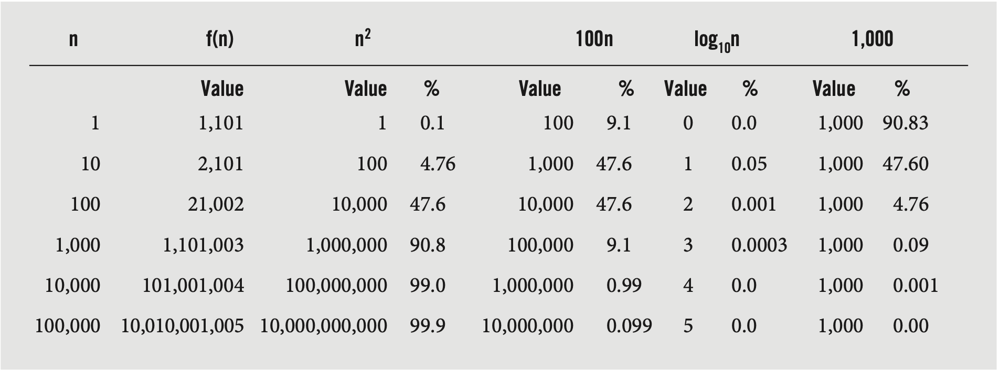

# Complexity Analysis
## Computational and Asymptotic Complexity
The same problem can be solved with algorithms that differ in efficiency and these differences in efficiency may be immaterial for processing a small number of data items, but these differences grow with the amount of data. To compare the efficiency of algorithms, a measure of the degree of difficulty of an algorithm called computational complexity is used. Computational complexity indicates how much effort is needed to apply an algorithm/how costly it is. The most common criteria for measuring efficiency are time and space, though time is usually more important. 
###
To evaluate an algorithms efficincy, real-time units such as microseconds and nanoseconds should not be used due to differences in how programming languages run and how efficient the system the algorithm is run on is. Rather, logical units that express a relationship between the size n, of the data and the amount of time required to process the data is best. A function expressing the relationship betwenn n and t is usually complex and calculating such a function is important only when it comes to large data, thus an approximation is sufficiently close to the original, especially when working with large datasets. 

###
## Big-O Notation
Def: $f(n)$ is $O(g(n))$ if there exist positive numbers $c$ and $N$ such that $f(n)$ $\le$ $cg(n)$ for all $n$ $\ge$ $N$
- $f$ is big-O of $g$ if there is a positive number $c$ such that $f$ is not larger than $cg$ for sufficiently large $n$'s 
- The relationship between $f$ and $g$ can be expressed by stating either that $g(n)$ is an upper bound on the value of f(n) or that in the long run, $f$ grows at most as fast as $g$
$$f(n) =2n^2 +3n + 1 = O(n^2)$$

###
## Properties of Big-O Notation
1. If $f(n)$ is $O(g(n))$ and $g(n)$ is $O(h(n))$, then $f(n)$ is $O(h(n))$
2. If $f(n)$ is $O(h(n))$ and $g(n)$ is $O(h(n))$, then $f(n) + g(n)$ is $O(h(n))$
3. $an^k = O(n^k)$
4. $n^k = O(n^{k+j})$ for $j \ge 1$
5. If $f(n) = cg(n)$, then $f(n) = O(g(n))$
6. $log{_a}{n} = O(log{_b}{n})$ for $a \ge 1$ and $b \neq 1$
7. $log{_a}{n} = O(lg{n})$ for $a \neq 1$ where $n = log{_2}{n}$

###
## $\Omega$ and $\Theta$ Notations
Big-O notation regers to ther upper bounds of functions while big-$\Omega$ deines the lower bound of the function
###
Def: The function $f(n)$ is $\Omega(g(n))$ if there exists positive numbers $c$ and $N$, such that $f(n) \ge cg(n)$ for all $n \ge N$

- $f$ is $\Omega$ of $g$ if there is a positive number $c$ such that $f$ is at least equal to $cg$ for almost all $ns$
- $cg(n)$ is a lower bound on the size of $f(n)$ or in the long run $f$ gows at least the rate of $g$

Def: $f(n)$ is $\Theta(g(n))$ if there exist positive numbers $c$1, $c$2, and N such that $c$1$g(n) \le f(n) \le c$2$g(n)$ for all $n \ge N$

- $f$ has an order of maginitude $g$, $f$is on the order of $g$, or both functions grow at the same rate in the long run