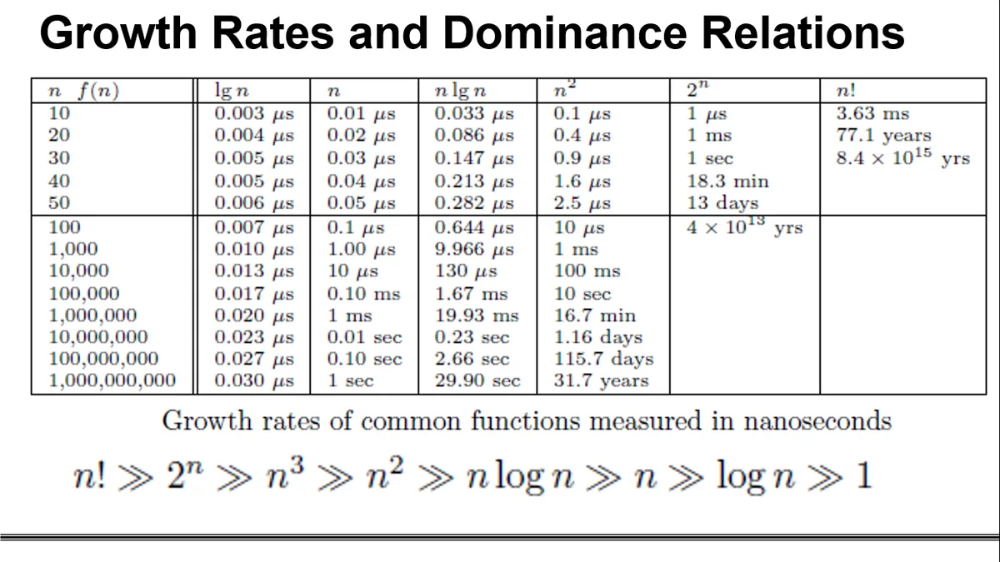

## Data Types
A data type in a programming language is a set of data with predefined values. Some examples of data types are integer, floating point, unit number, character, etc. 
### System-defined data types
Data types that are defined by the system are called primitive datatypes. Some examples include float, char, int, double, bool, etc. The number of bits allocated for each primitive type depends on the programming languages, compiler, and operating system.
### User defined data types
If the system-defined data types are not enough, then most programming lanuages allow the user to define their own data types. In C/C++ this comes in the form of structs and in java classes.   

stuct newType: { 
>int data1; 
    float data2; 
    ... 
    char data 

};

## Data Structures
A data strucutre is a special format for organizing and storing data. General data structures include arrays, files, linked lists, stacks, queues, trees, graphs, and so on. The two types of data strutures are as follows:  
1. Linear Data Structures: Elements are accessed in a sequential order but it is not compulsory to store all elements sequentially.  
Ex: Linked Lists, Stacks, Queues
2. Non-Linear Data Structures:  Elements of data are not structured in a linear fashion.  
Ex: Graphs, Trees
## Running Time Analysis
Running time analysis is the process of determining how processing time increases as the input size increases. The input size is the number of elements in the input.
## Growth Rates
The growth rate is the rate at which the running time increases as a function of the input.
### Commonly Used Rates of Growth

   

[Home](README.md)
